# Atom で Github を使う方法

## 1） Atom に必要なパッケージをインストールする。

Atom のメニュー Preference > Install で下記のパッケージをインストールする。

1. japanese-menu……文字通り日本語化パッケージです
2. markdown-preview-plus （プレビュー用パッケージ）
3. reflow-japanese (設定画面で文字長を80にしてください、日本語40文字できれいに自動で強制改行してくれます）……必須パッケージです
4. markdown-writer (Markdown書式を覚えていない場合やショートカットキーを多用したい場合）
5. wordcount (ファイルの文字数表示、2バイト文字も1文字としてきちんと表示されます）

余裕があれば、[pandoc](http://pandoc.org/) をインストールする（設定不要だがPATHが通っている必要があり、Windowsの場合は要確認）

## 2）Github の本家リポジトリを自分のパソコンにクローンする

1. 右上緑ボタン Clone or download をクリックして Open in Desktop を選択する。Github App のインストールを促されると思うので、それにしたがってインストールして、もう一度挑戦（ひょっとしたらこのあたりは改善されてスムーズにいくかも知れないので報告お願いします。

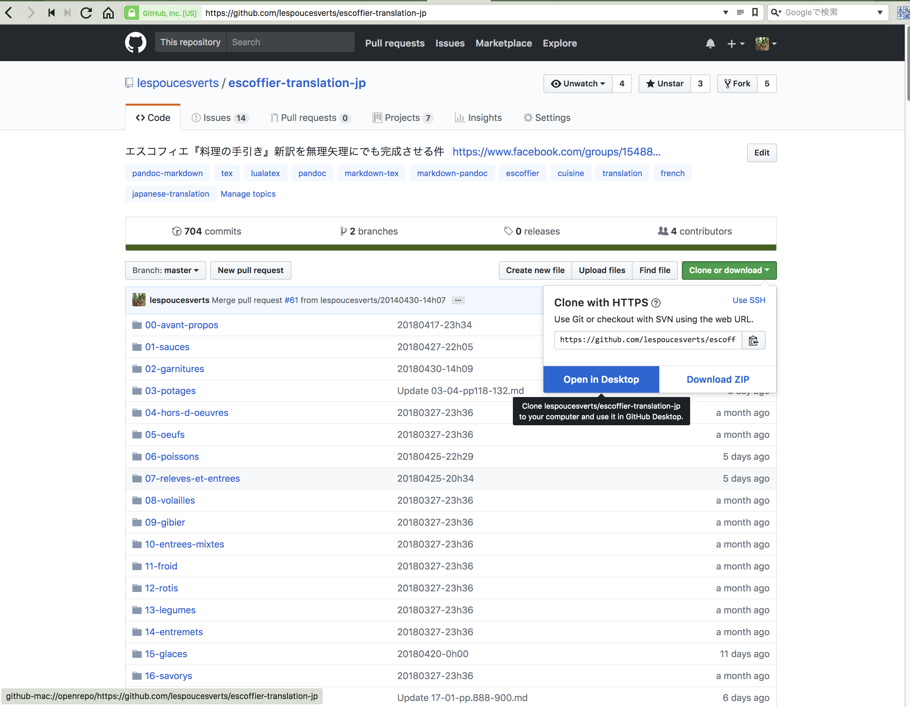

2. Macの場合は「書類」フォルダの中に、このescoffier-translation-jpフォルダが作られて、コピーされていると思います。

3. Atom を起動します。最後に使ったファイルがなければ真黒（UIテーマによりますが、要は何もないUntitled状態でしょう。

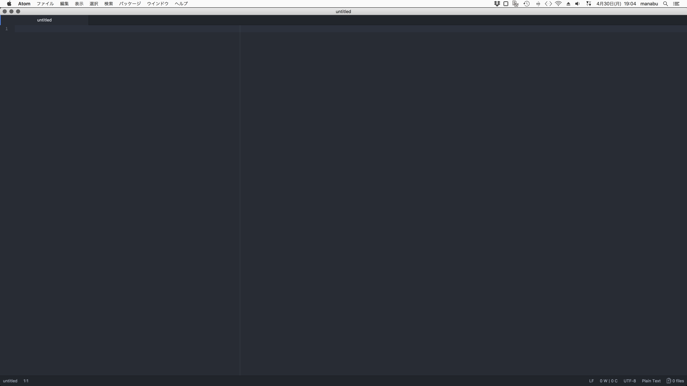

4. 先程クローンしたescoffier-translation-jpのフォルダを「プロジェクト」として開きます。ファイル>プロジェクトファイルを追加。

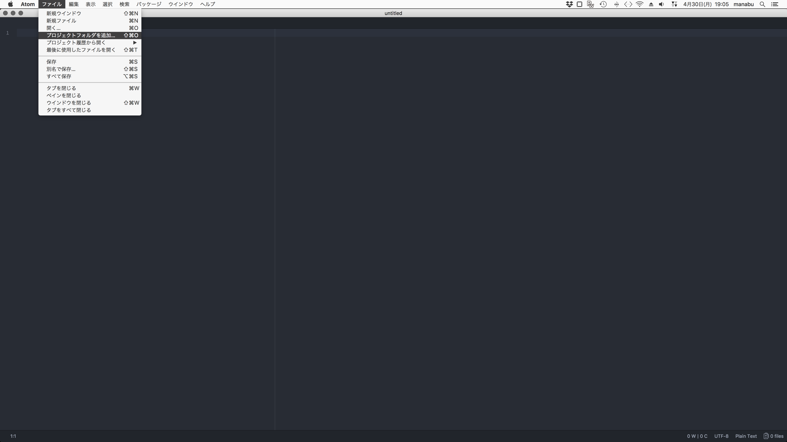

5. .git という隠しフォルダがあります（Macの場合はFinder>環境設定>詳細、で「全てのファイルの拡張子を表示にしておいたほうがいいでしょう）。この状態で「開く」と

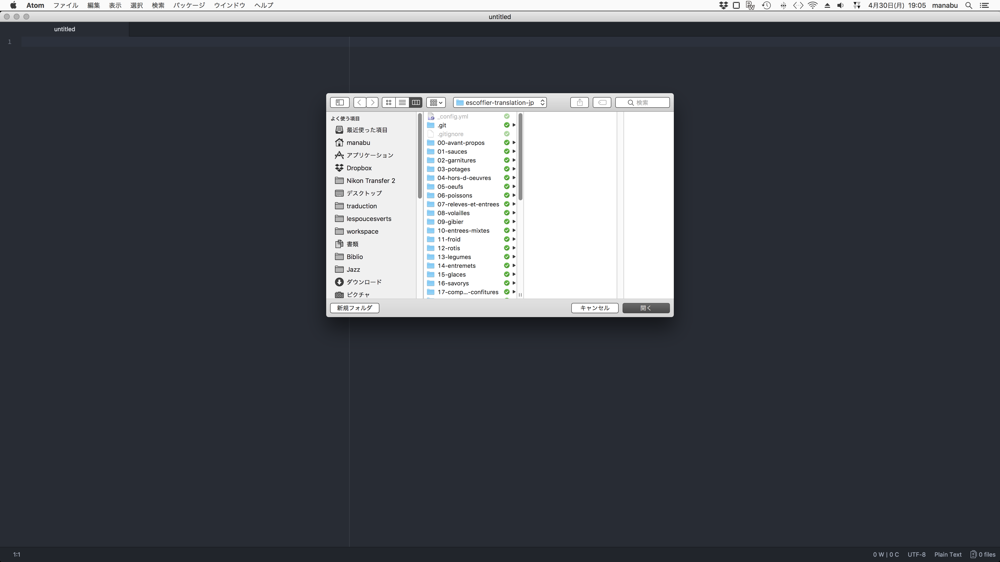

6. こんな感じで左にディレクトリとファイルのペインが、右側にGithubのペインで表示されます

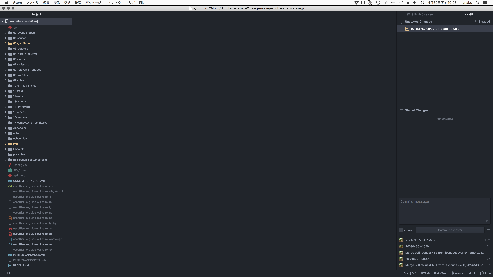

7. 左ペインから作業するディレクトリ>ファイルをシングルクリックで開きます。ここでは02-garnitures/02-04-pp89-103.mdを開きます

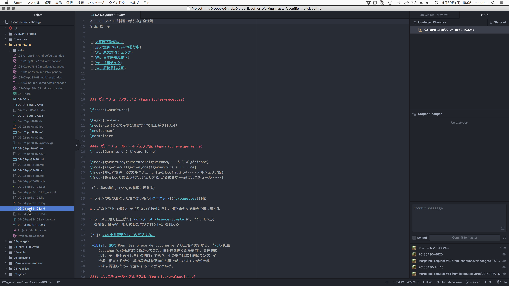

8. プレビュー表示してみましょう。パッケージ>Markdown Preview Plus > Toggle Preview ですが、Ctrl+Shift+Mがショートカットキーです。いったんLaTeX処理ができないとか文句を言われるかも知れません。その場合はCtr+Shift+xとしてください。

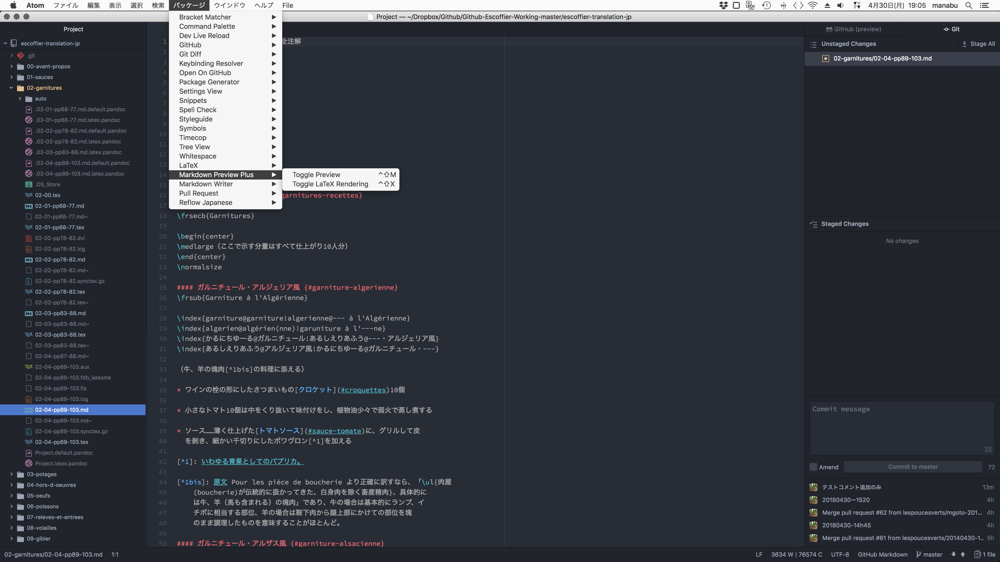

9. こんな感じでプレビューが右に出ます。左が原稿ファイルです。あくまでもプレビューなので、このプロジェクト用に作成したTeXコマンドなどは反映されません。分数表記が正しいくらいです。あと注は全部、ファイル末尾にいきます。Web版Githubのプレビューよりかなりマシですが、所詮はプレビューですから……

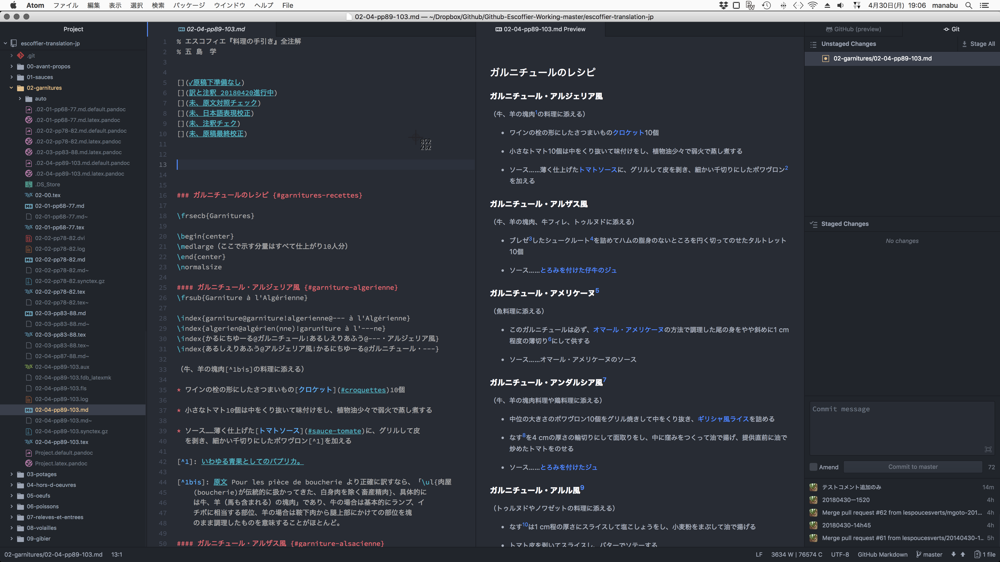

10. ファイルにガルニチュール・ミラボーの項目を訳しました（左下の赤く囲ったところ）。すると、右上の赤く囲ったところ、Unstaged Changes のところにファイル名が追加されます。

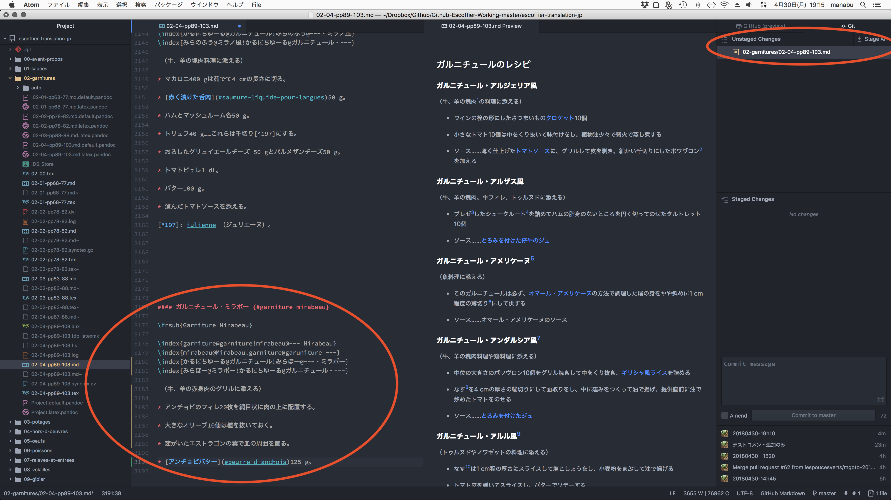

11. 右上の Stage All を押しちゃってください。

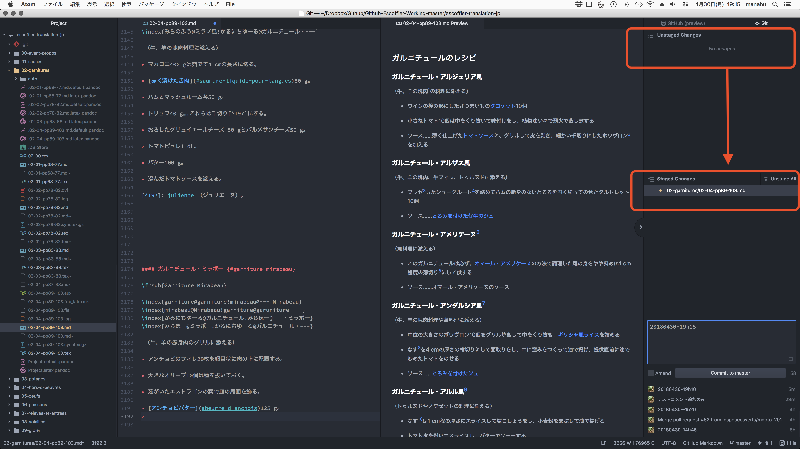

12. 大事なことです。コミットには必ずひとこと入れてやる必要があります。ここは日付と時間
を入れています。右の下のほうです。

13. すぐ下の Commit to master を押しちゃってください。ダイジョブです。失敗しても後から元に戻せますから。

14. 右下のリスト部分にいま入力した日付と時間（git的にはコメント）が加わります。

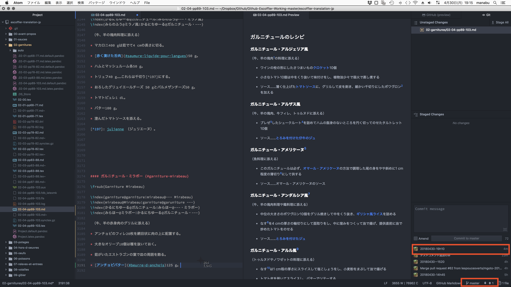

さらにその下、master ↓↑ というところに注目してください。

ここでブランチを切ってもいいんですが、master