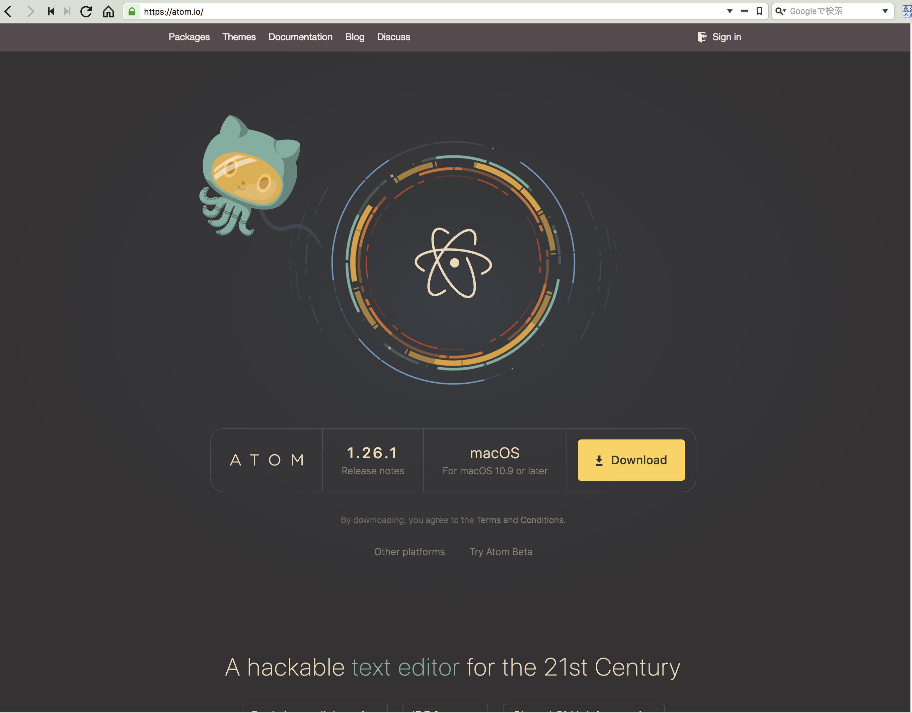
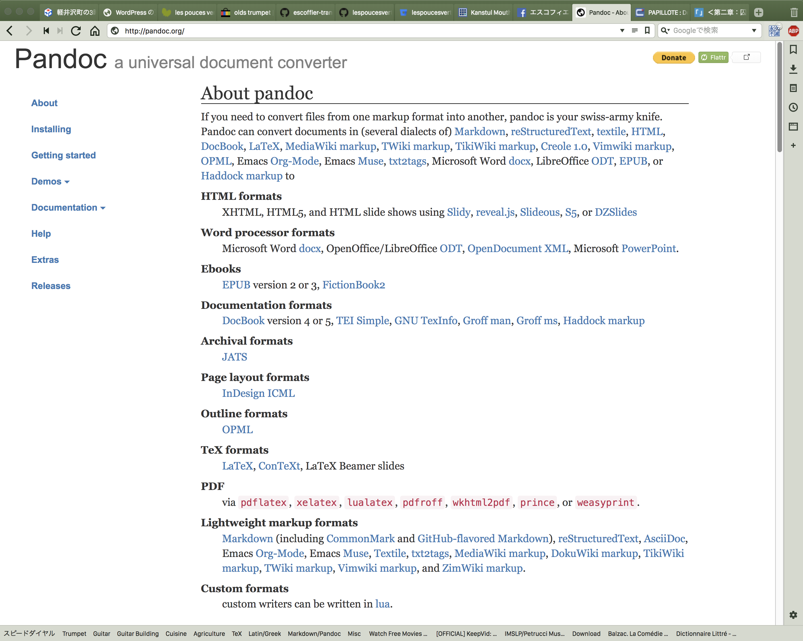
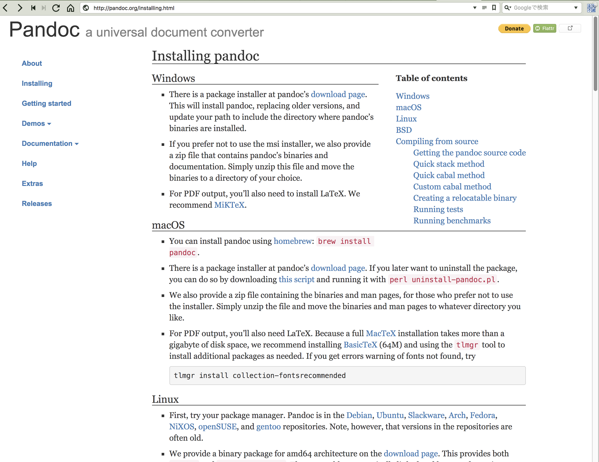
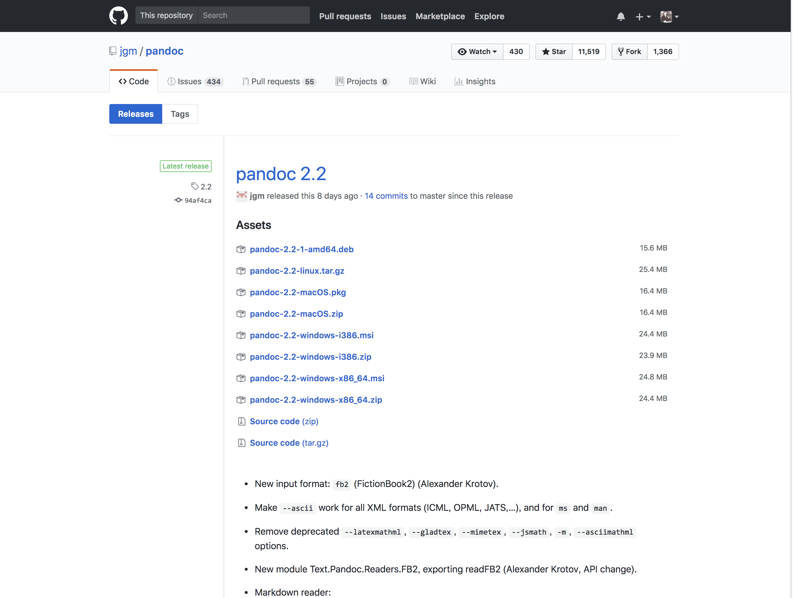
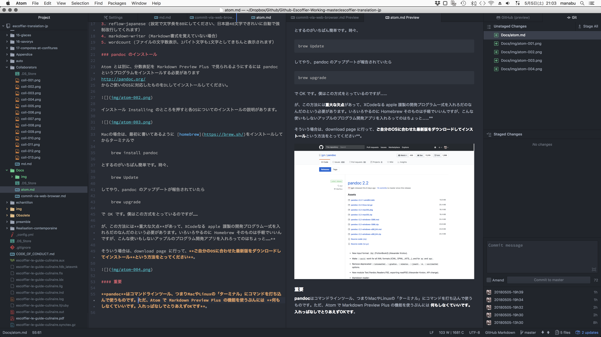
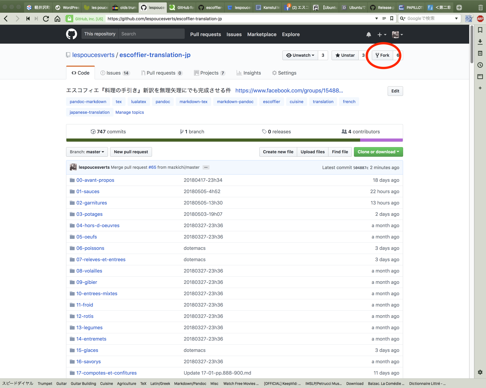

# エディタ ATOM の使用法

Github 謹製のエディタ Atom は操作方法もそこそこわかりやすく、とても優秀なエディタです。エディタとは「ワープロ」と違いプログラムのソースコードやWEBサイトのhtml, php そして Markdown ドキュメントを書くのに使う、**ひたすら文字を入力する**ということに特化したアプリです。つまり、文字の装飾とかそういう機能が付いていないものです。

さて、この Atom はエディタとしてはかなり新参者で、**重い**のと**OSによってはやや不安定**、開発スピードが早くて**追従しきれていないパッケージが頻出する**という欠点があります。また、Emacs と比べるとスピードと機能面で見劣りしますし、Vimの安定性には遠く及びません。とはいえ、デフォルトの、ただインストールした状態でもそこそこお洒落な見た目で「デキる男（女）を演出するにはもってこい、ちょっと以前にスタバで Macbook 広げてた連中の間では Sublimetext というエディタが流行っていたそうですが、すぐに埋没しちゃった感があります。そいういう意味でも Atom は、これから期待というところでしょう。

はじめに申しあげておきますが、僕自身は画像の貼り込みの多い Markdown ファイルを作るとき以外はほぼ全て Emacs という昔々からある、もう20年以上も愛用しているエディタを使っています。だから、Atom のすべてを把握しているわけじゃないし、上手に説明できているかはあんまり自信がありません。

これまでのところ、『料理の手引き』全注解プロジェクトでは「イチオシ」のエディタということにしてあります（ちょっと意見が変わりつつあり、Emacs も推薦していこうかな、と考えています）。

## 1.　DLとインストール

まずはエディタ [ATOMをhttps://atom.io/](https://atom.io/)からDLしてインストールしてください。Windows, Mac, Linux 対応です。Mac の場合は zip ファイルがDLされて、ダブルクリックするとアーカイブユーティリティが「解凍」して Atom.app が出来ます。そのまま起動させてもいいですが、「アプリケーション」フォルダに移動させておきましょう。Linux も Ubuntu のような Debian 系の場合は、ダウンロードしたファイルをダブルクリックするとインストール画面になりますので大丈夫です。Windows のことはわかりませんが、ユーザー数が多いOSなので情報はいくらでも見つかると思います。
※注意…**Ubuntu ソフトウエアセンターからインストール出来る Atom はどういうわけか日本語入力が通りません。上記、atom.io のサイトから DL したものを使ってください**。

## 2.　追加パッケージ

追加パッケージをATOMのメニューのPreference>Installで導入します。Preference メニューはOSによって場所が違うようなのですが、Macの場合はリンゴマークの右、**Atomのメニュー項目のやや上の方** にあります。Linux は **Edit メニュー項目の下のほうです**。

### このプロジェクトで Atom を便利に使うのに「あったほうがいい」パッケージ

1. japanese-menu （日本語化パッケージ）
2. markdown-preview-plus （プレビュー用パッケージ）
3. reflow-japanese (設定で文字長を80にしてください、日本語40文字できれいに自動で強制改行してくれます）
4. markdown-writer (Markdown書式を覚えていない場合）
5. wordcount (ファイルの文字数表示、2バイト文字も1文字としてきちんと表示されます）

### pandoc のインストール

Atom とは別に、分数表記を Markdown Preview Plus で見られるようにするには pandoc というプログラムをインストールする必要があります
http://pandoc.org/
からお使いのOSに対応したものをDLしてインストールしてください。

インストール Installing のところを押すと各OSについてのインストールの説明があります。

Macの場合は、最初に書いてあるように [homebrew](https://brew.sh/)をインストールしてからターミナルで

    brew install pandoc

とするのがいちばん簡単です。時々、

    brew Update

してやり、pandoc のアップデートが報告されていたら

    brew upgrade

で OK です。僕はこの方式をとっているのですが……

が、この方法には**重大な欠点**があって、XCodeなる apple 謹製の開発プログラム一式を入れろだのなんだのという必要があります。いろいろやるのに Homebrew そのものは手軽でいいんですが、こんな使いもしないアップルのプログラム開発アプリを入れろってのはちょっと……**

そういう場合は、download page に行って、**ご自分のOSに合わせた最新版をダウンロードしてインストール**という方法をとってください**。

#### 重要

**pandoc**はコマンドラインツール、つまりMacやLinuxの「ターミナル」にコマンドを打ち込んで使うものです。ただ、Atom で Markdown Preview Plus の機能を使うぶんには **何もしなくていいです。入れっぱなしでとりあえずOKです**。

## 3.　Atom を使ってみる

いまこのドキュメントを書いているスクリーンショットです。左からプロジェクトのフォルダにあるファイル一覧、行番号のついているのが atom.md という名前のこのファイルそのもの、中央より右が Markdown Preview Plus によるプレビューです。そこそこ使える感じしませんか? 右端は Git の操作ペインです。

### Markdown Preview Plus を活用した「誤字、脱字チェック」

#### 自分のパソコンのハードディスクにプロジェクトのリポジトリをクローンする

まずは自分のパソコンにプロジェクトのフォルダを複製します。ターミナル（アプリケーション>ユーティリティにあります）を開いて、プロジェクト専用のフォルダを作ります。たとえばMacとかUbuntu（英語でインストールして日本語を追加したもの）の場合、

    mkdir ~/Documents/github

とすると、「書類」フォルダの中に github という名前のフォルダが作られています。またターミナルに戻って、そこにプロンプトを移動させます

    cd ~/Documents/github

次に、プロジェクトのファイル一式をまとめて DL してしまいます。このあたりは README.md にも書いたので重複しますが……

1. まず、プロジェクト本家のリポジトリをフォークします。画面右上の Fork というボタンを押してください。

次に、自分のパソコンの適当なディレクトリ(たとえばMacなら「書類」のなかにEscoffierとでも)フォルダを作ります。

2. Mac の場合は「ターミナル」(アプリケーション>ユーティリティにあります)を開いて、

    cd ~/Documents/Escoffier

と打ち込んでください。Escoffierは先程例に出した新たにつくったフォルダ名です

3. つぎに、ターミナルで自分がフォークしたリポジトリをクローンします。HTTPSを使うのがいまはデフォルトになっているようです。ブラウザで、自分のアカウント/escoffier-translation-jp というフォークしたリポジトリにアクセスして、右の緑のボタンClone or Download をクリックします。さらに、https://github.com から始まる文字列の右側のよくわからんアイコンをクリックしてください。クリップボードにこのフォークされたリポジトリのアドレスがコピーされます。

4. この状態でターミナルに戻ります。

    git clone

と打って、ペースト(コマンド+V)します。

    git clone https://github.com/youraccountongithub/escoffier-translation-jp.git

となったらリターンキーです。youraccountongithub のところはご自分のアカウント名が入ります。

場合によってはしばらく待たされます。

5. これで「あなたがフォークしたエスコフィエのリポジトリがあなたのパソコンにある」状態になります。

6. これだけだと、「**あなたがフォークした時点での**エスコフィエのリポジトリ」の内容に過ぎません。なので、本家と同期させてやります。ターミナルで

    git remote add upstream https://github.com/lespoucesverts/escoffier-translation-jp.git

と打ってください。これで本家に対してupstreamという名前をつけて「つながった」ことになります。

7. 次回から、作業の前や途中でターミナルに

    git fetch upstream

    git checkout master

    git merge upstream/master

と「おまじない」3つ入力をすると、本家とリアムタイムで同一の内容がお手元のパソコンにあるリポジトリにコピーされます。ただし、**本家は一日に何度もアップデートしている**ので、やっぱりこの方法はあんまりお勧めできないかも。この先の段階として、本家に対して自信をもってプルリクエストできる方以外は、ブラウザで直接このリポジトリをいじってプルリクエストする方法をとりあえず採用したほうがいいでしょう。

8. それでも Pull-request まで Atom で完結したい……

擬似的な手段ですが、[pull-request](https://atom.io/packages/pull-request)というパッケージを Atom にインストールすると、比較的簡単にプルリクエストが送れるようになります。途中でなんたらトークンを取得しろとかといってくるので、そのとおりにすれば送れます。が、結局はブラウザが立ち上がっちゃうんで、Mac や Win の方は Github App か SourceTree を使うほうが便利でしょう。Ubuntu でも git クライアントはいろいろあります。Ubuntu の場合、gitg か、僕は使ったことがありませんが [Gitkraken](https://www.gitkraken.com/) あたりでしょうかね。gitg は

    sudo apt install gitg

で簡単にインストールできます。

エディタの操作だけで全部を出来るようにするのはかなり上級編で、やっぱりそうなると Emacs 一択ということになるでしょうかね。いや、Vim もありますが、僕はあまり詳しくないんで、次のドキュメントは Emacs を使って、pandoc と LuaLatex で一気に PDF を作って、プッシュ（そこまで出来る方ならプッシュ権限をお出ししてもいいでしょう）するところまで説明してみようと思っています。

ちなみに、僕が Emacs でやっている作業のほとんどを Atom と Github App で出来るようになる筈なんですが、なにぶんAtomにはそこまで詳しくないんで、すみませんです。

## 最後に

このプロジェクトで重要なことは、あくまでもエスコフィエ『料理の手引き』全注解を完成させることであって、Github を高度に使いこなすことじゃありません。いちばん簡単なのは、PDFのファイルと生原稿を両方見ながら（慣れると生の原稿ファイルだけでも誤字、脱字の修正くらいは出来るようになります)、**WEBブラウザで「えんぴつアイコン」を押して編集モードで編集、プルリクエスト、の手順がいちばん簡単です**。

でも次のドキュメントは Emacs について書きます(笑。
