# WEBブラウザでファイルの下準備、下訳、編集、校正に参加する方法

## 推奨環境（パソコンの場合です）

* ブラウザはなるべく**最新の** Chrome, Firefox, Vivaldi, Safari などをお使いください（新しいブラウザが動いて日本語入力が出来ればOSは何でも大丈夫です。フランス語入力ができればなおバッチリです）。

### 1. ブラウザで Github のトップページ [https://github.com/](https://github.com/) にアクセスする

たぶんこんな感じでアカウントを作れという画面になります。必要なのは

* ユーザー名
* メールアドレス（gmailあたりがいろいろ使い勝手もいいので無難でしょう）
* パスワード

だけです。

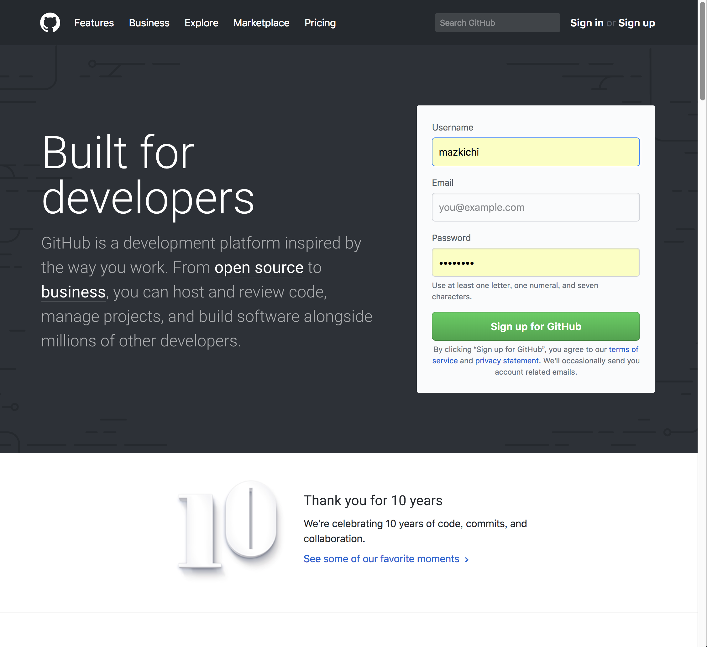

### 2. メールでの認証

これらを入力すると画面が切り替わって、しばらくすると入力したメールアドレス宛に Verify しろというメールが届きます。「迷惑メール」フォルダに入れられてないかよく注意してください。

    Verify email address

というリンク（赤丸部分）をクリックするか、下の長ったらしいURLをブラウザにコピペます（前者のほうがラクですね）。

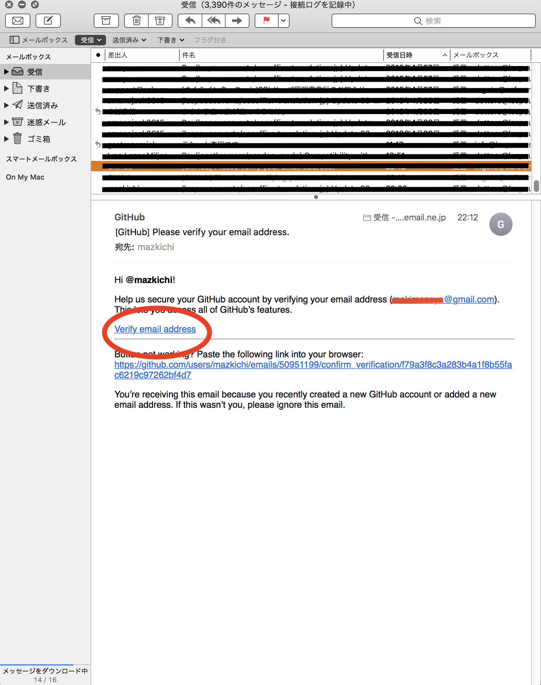

認証されると次のような画面になります

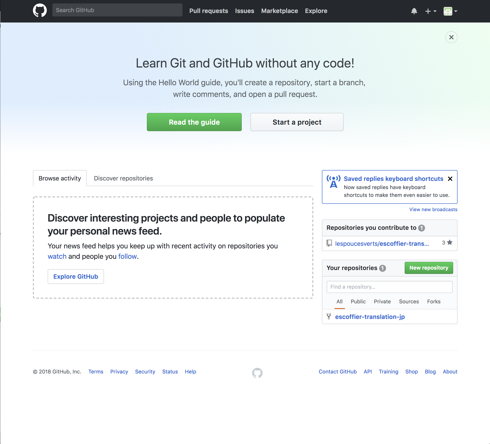

とりあえず「全注解」プロジェクトに参加するには、**このページは無視しちゃってもいいです**。真面目に読んでももちろんオーケーです。

### 3. 「全注解」リポジトリにアクセスする

全注解の作業リポジトリは、

[https://github.com/lespoucesverts/escoffier-translation-jp](https://github.com/lespoucesverts/escoffier-translation-jp)

です。アクセスすると下のような画面になります。すっごく長いです。上のフォルダアイコンがずらっと並んでいるところがリポジトリの本体です。その下の長い日本語の文章はREADME.mdが自動表示されているんですが、現状は「温泉旅館」方式でいろいろ書き足しちゃったので、この文章の後で読んでください。

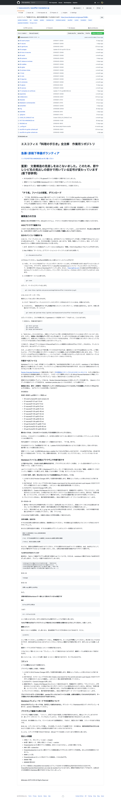

### 4. 作業ファイルにアクセスする

例として 03-potages というディレクトリ（フォルダ）にある作業ファイルを開いてみましょう。フォルダアイコンのあたりをクリック（タップ）してください。いま使ってるのはブラウザですからシングルクリック（タップ）**1回** だけですよ。

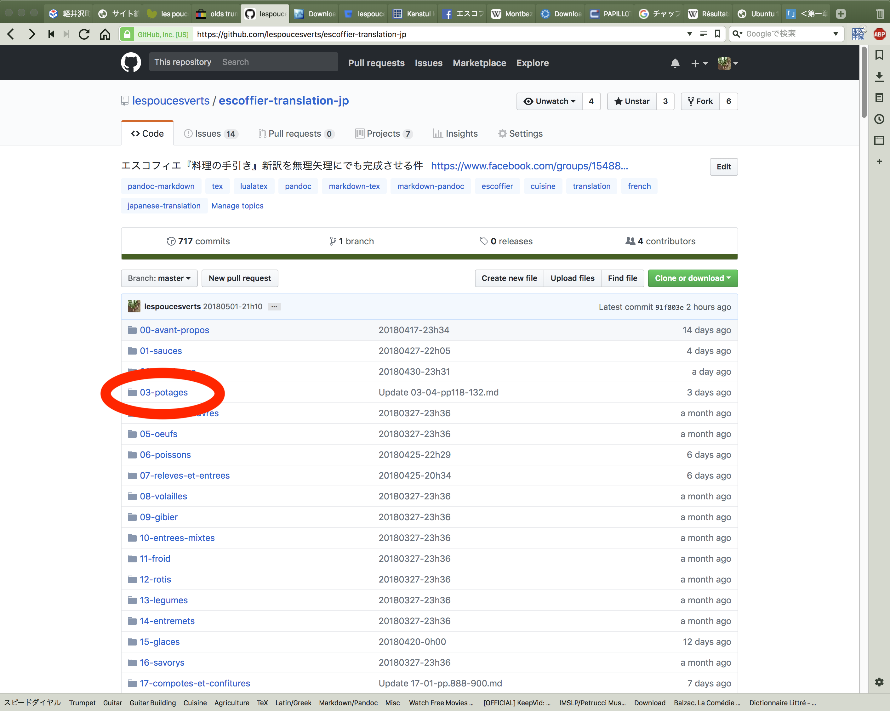

ためしに 03-07-pp139-146.md というファイルを開いてみましょう。その上の方を見るとわかると思いますが、最後が .tex となっているファイルは**既に作業中**のもので、同じファイル名で .md と .tex の2種があることがほとんどです。.tex となっているファイルはPDF作成用の「中間ファイル」です。見てもいいですが、目まい、頭痛などの原因になる場合があります。

というわけで、03-07-pp139-146.md をシングルクリック（タップ）して開いてみます。

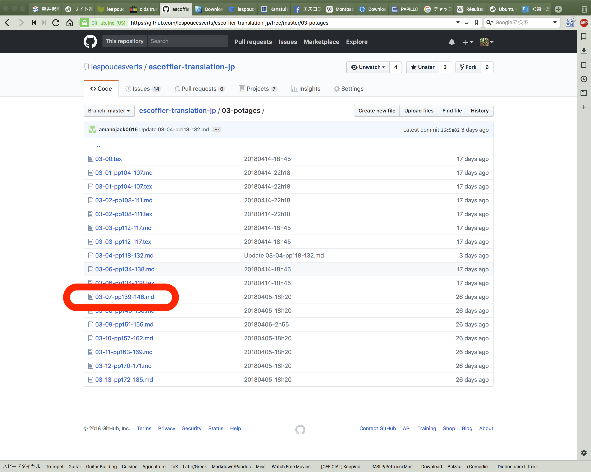

こんな感じで、Githubのマークダウンプレビュー画面になるんですが、今回のプロジェクトでは**注**を多用しているので、正常に表示してくれません。

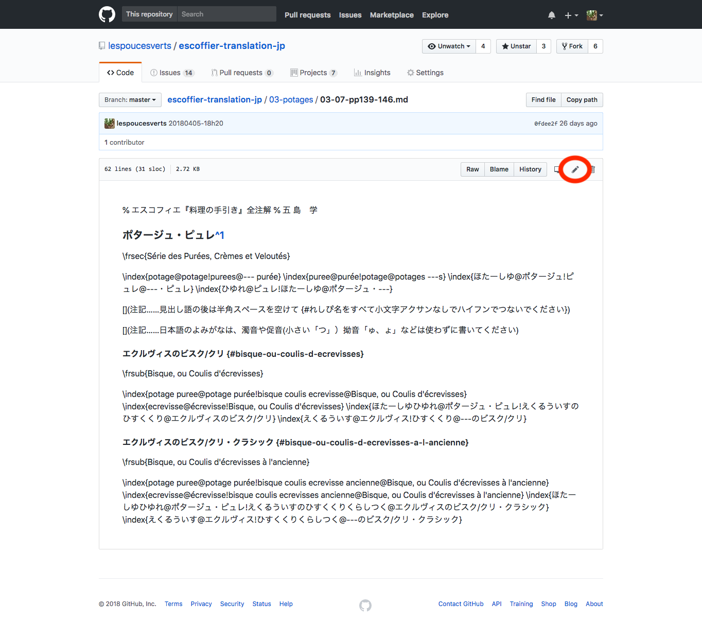

### 5. 編集モードにする

というわけで、上の画像の右上に赤丸で囲った「えんぴつアイコン」をシングルクリック（タップ）してください。小さいから気をつけてください。右端のは「ゴミ箱アイコン」です。なんでこんなところに配置してるんだか……おっかないったらありゃしません（笑。

こんな感じの画面になります。日本語入力フィールドに「生原稿」がそのまま表示されています。

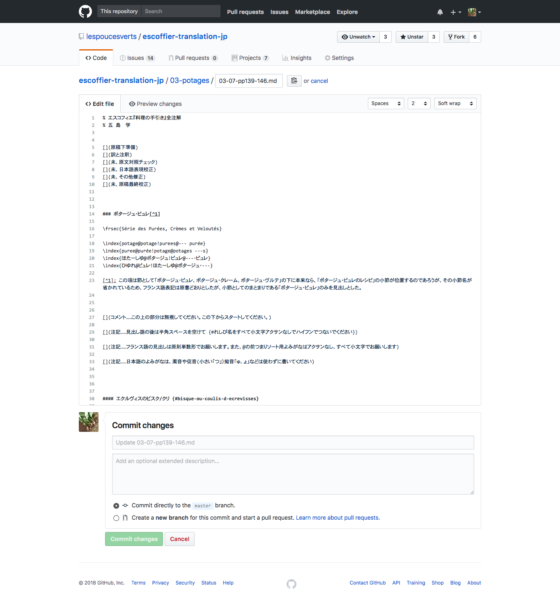

「日本語入力フィールド」ですから、適当なところをシングルクリック（タップ）すると「カーソル」が入ります。あとは普通にワープロなどと同様に文を書いたり消したり出来るようになります。

### 6. プルリクエストする

ファイルの下準備、下訳、編集、校正、どの作業でも、ひと通り作業したら、画面のいちばん下、緑のボタンのところに注目してください。入力フィールドが2つあります。1つめはコメント。これは絶対に必要ですが、デフォルトで Update なんたら、とあるのでそのままでも大丈夫です。その下のフィールドにはどんな作業内容かごく簡単に書いてください。

で、緑色の Propose file change というボタンを押します。

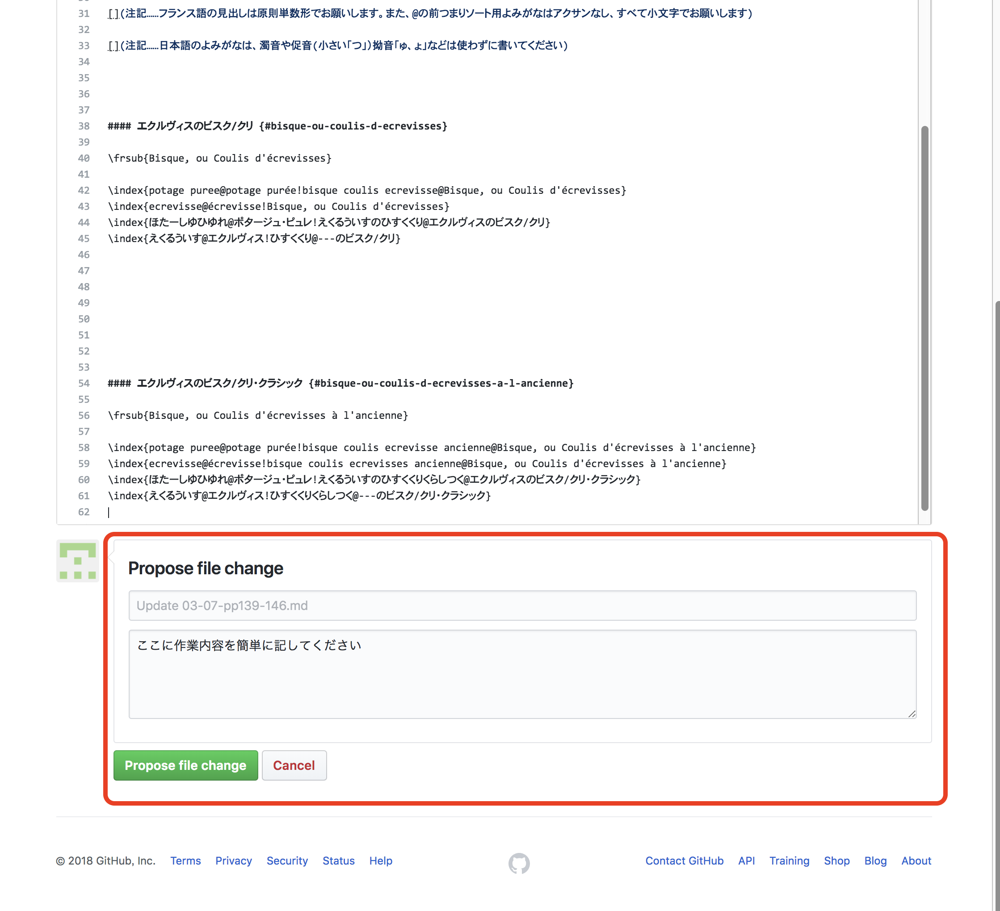

まだ終わりじゃないです。いったん画面が切り替わって

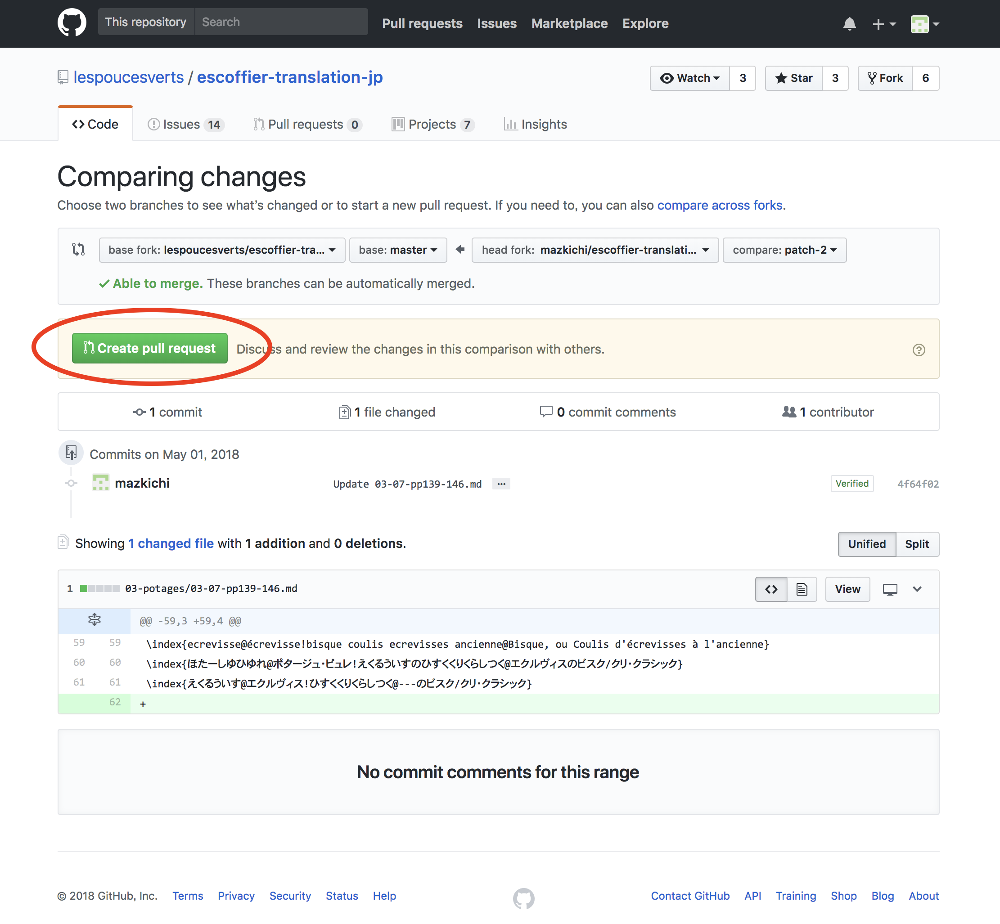

となります。赤丸で囲った Create pull request を押してください。

まだ終わりじゃないです。このあたり、ミスを避けるためか、かなーりしつこく確認されます。

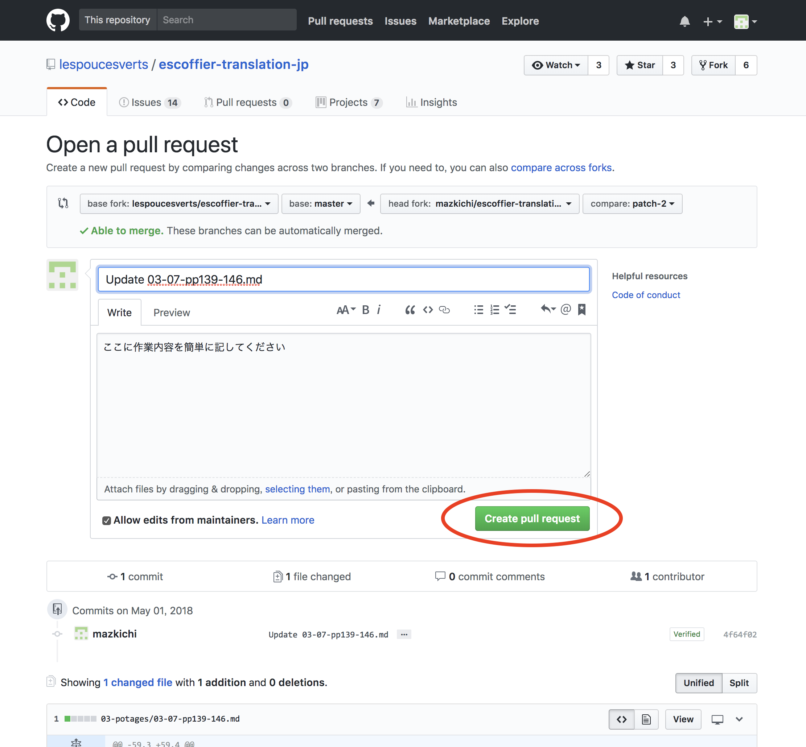

「もういちど見直してからプルリクエストしてね」ということだと思います。下のほうに変更点が色付きで表示されます（この画像ではカットしちゃいましたが）。で、もういちど緑の Create pull request を押してください。

### 7. プルリクエストが送信された状態

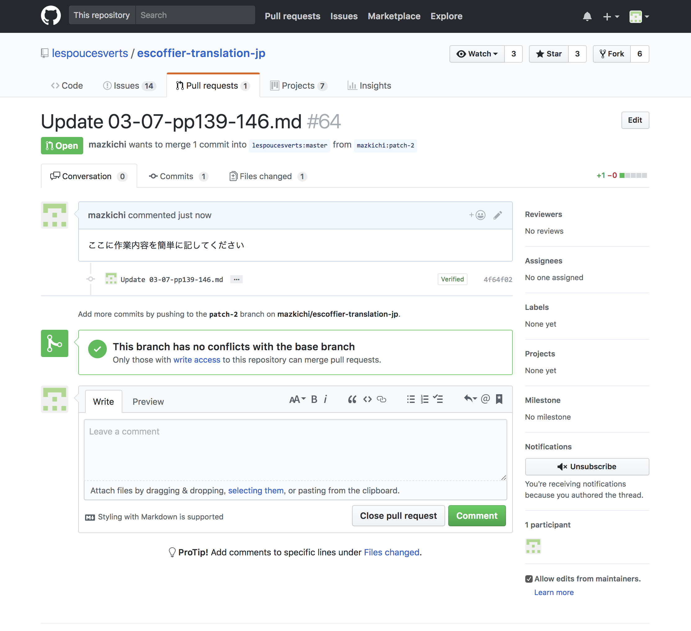

これで僕のところに「プルリクエスト」が送られてきます。そのまま受け容れる場合はリポジトリ本体のファイルが更新されます（マージ）。部分的にコメントや保留をつける場合は、修正してからもう1度、プルリクエストの作業をしてください。あと、却下という場合ももちろんあります（クローズ）。

逆に言うと、この方法の場合には基本的に、僕がOKを出さないかぎりはリポジトリのファイルには一切変更が加わらない、ということです。だから失敗を怖れずに挑戦してみてください!

ご協力いただくからには、すべてマージ出来るといいのですが、より良いものを、**よりすばらしい全注解を実現するためには、こういった修正や却下も必然的に出てきてしまいます**。その点はあらかじめご了承ください。

### 8. Watch のすすめ

リポジトリに変更やプルリクエスト、Issuesでのディスカッションの投稿があると、Watch を設定しておくと、登録したアドレス宛にメールが届きます（これの仕訳をやるのにGmailは便利だったりするんです）。Watchする方法は、画面右上の「目」のアイコン Watch をシングルクリック（タップ）するだけです。他の Star とか Fork は気にしないでいいです。あとは適当にいじりながら慣れていってください。わからないことがあればFB経由かIssuesにスレ立て（出来ると思います）してお尋ねください。

