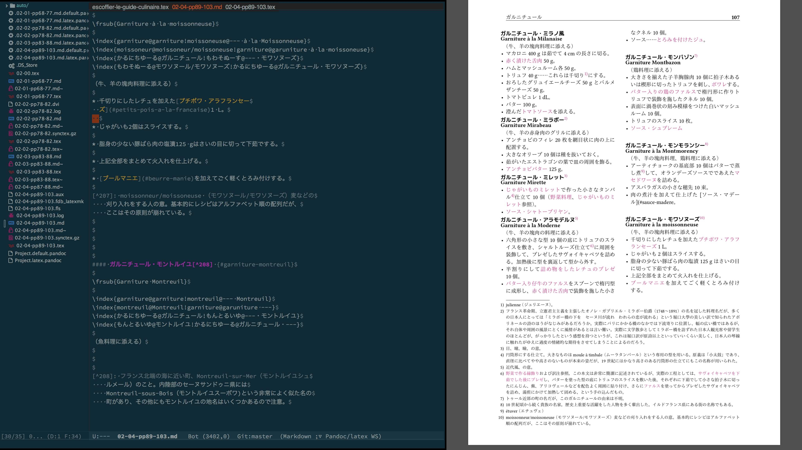
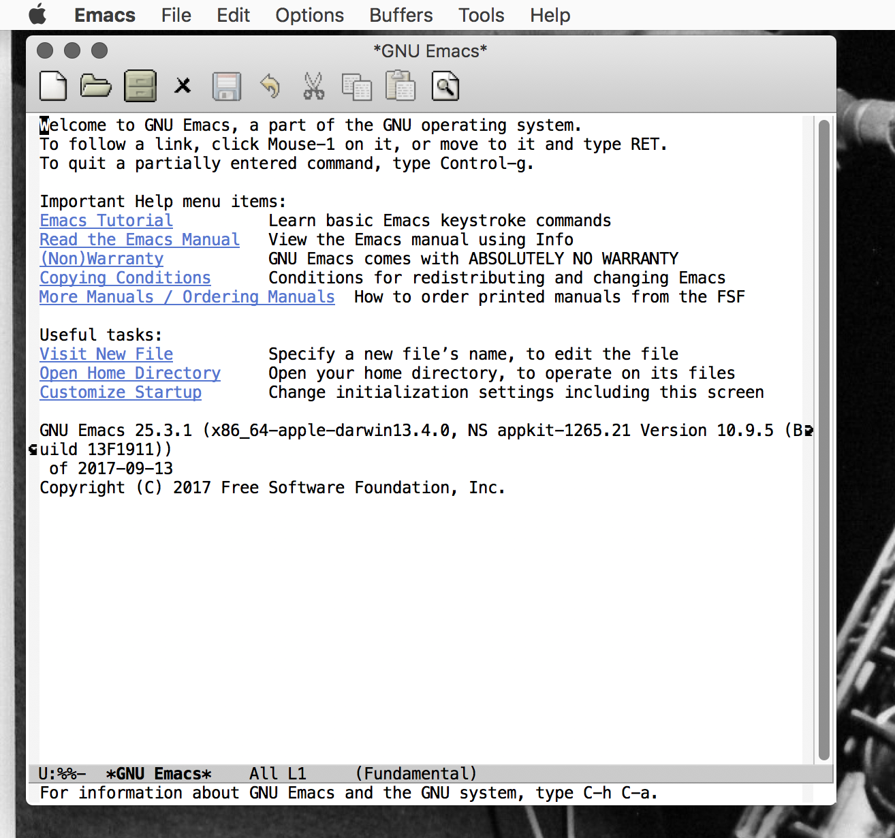
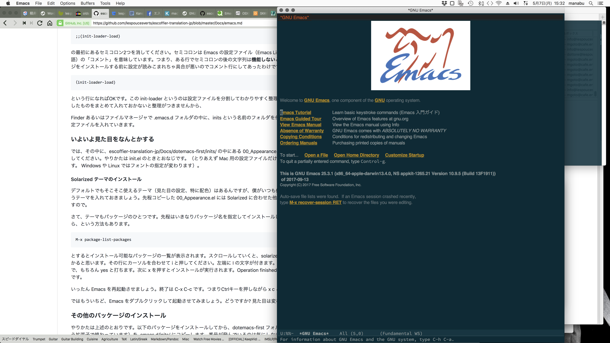

# Emacs, pandoc, Lualatex で簡易PDF組版

どうです? このスクリーンショット。左が Emacs 、右が Skim App という PDF 閲覧用アプリです。Macの「全画面表示」を二分割しています。

見た目だけなら Atom に決してひけをとらないと思います。そして機能は Atom 以上、ただちょっとクセがあるのが難点。ショートカットキーなどでCtrl キーとESCまたはOptionキーをやたら多用します。それがクセです。あと設定は Emacs Lisp というプログラム言語で書かなきゃいけない。でも、基本的にコピペでどうにかなっちゃいます。

そんなわけで、いきなりこういう見た目で作業性よく出来るというわけじゃありません。インストールしただけの「素の Emacs 」は相当にショボいです。これにいくつかのパッケージ（追加プログラム）を入れて、「設定ファイルを書く」と上のスクリーンショットのようになるわけです。しかも、まるっきり「素」の状態で Mac の場合には日本語入力にやや難があるという話もあるようです（僕はまるっきり「素」では使わないので気づいたことがありません）

## 目次

* [推奨環境](#推奨環境)
* [必要なアプリとフォント](#必要なアプリとフォント)
* [Emacsをインストールする](#Emacsをインストールする)
* [最初の設定](#最初の設定)
* [Emacsの見た目をなんとかする](#Emacsの見た目をなんとかする)
* [エディタの流儀](#エディタの流儀)
* [キーボード達人への道](#キーボード達人への道)

## 推奨環境

* Macintosh ……現行の25.3 は OS 10.9 以降だったと思いますので、それ以前の OS のままの古い Mac の場合はバージョン 24.3 あたりを使えばだいたい問題ないと思います。
* Ubuntu Linux ……フォント設定のところが変わります。
* Windows …… 説明できません。ごめんなさい。

## 必要なアプリとフォント

* Emacs ……各OSに対応したものがあります。
* pandoc
* IPAフォント
* MoboMogaフォント
* Lualatex, luatexja を含む TeX 一式

### おすすめ日本語入力 SKK

* Mac 用 [Aquaskk](https://github.com/codefirst/aquaskk/releases)
* Windows 用 [corvuskk](https://github.com/nathancorvussolis/corvusskk)
* Ubuntu 用 ibus-skk ……Ubuntuで apt install を使ってインストール可能

「連文節変換」とか「予測変換」なんて機能はいっさいなし。漢字にしたい語句を打つときに 最初の文字だけshift キーと同時押しでローマ字入力してスペースキーを押してその語句を変換するというまことに単純明快な入力方式。とはいえ、設定次第では「予測変換」も「送りかな」もちゃんと使えるので、慣れると一般的な連文節変換の3倍以上早く変換できるようになります。

**ブラインドタッチ** で日本語のローマ字入力ができる場合は絶大な入力効率と、自分自身の文体の保持が出来ます。ある意味で「手書き」で日本語を書く感覚に近いです。

そして、Emacs といえば SKK なんです。いや、ほかにも日本語の入力方式はいろいろあるし、多少の難があるという**うわさ**はあるけどOS標準の日本語入力が通るってことらしいんで、無理にとは申しませんが、そもそも SKK は Emacs 用に開発されたものらしいんで。

これも慣れると手放せなくなるプログラムです。

### pandoc

文書形式変換プログラムです。http://pandoc.org/ から各OS用のものが DL 出来ます。コマンドライン（つまり「ターミナル」にコマンドを入力して使う）プログラムです。が、いちいちコマンドを入力するのも面倒、という場合に Emacs のパッケージ pandoc-mode を使います。そうすればコマンドを覚えていなくても、メニューから選択して実行できますし、慣れればショートカットキー操作でほんの3ストロークくらいで文書変換が可能になります。

対応しているフォーマットは入力側が、このプロジェクトで使っている Pandoc Extended Markdown の他いろいろ、出力側も TeX, PDF, docx, html, epub などものすごくたくさんの種類があります。

### LaTeX

Markdown 書式の原稿から、今回のプロジェクトで作っているようなレイアウトのPDFと索引、目次、文献一覧などを**自動で**組版するために使うプログラム群です。各OS用があり、おなじ LaTeX でもいろんな種類があります。この「全注解」プロジェクトでは LuaLatex というのを使っています。

詳しくは「[TeX-Wiki（日本語）](https://texwiki.texjp.org/)」にいろいろ情報が出ています。

Mac の場合は [TeXLive](https://www.tug.org/mactex/)を一式入れてしまうのが簡単でしょう。Basic TeX といって「最小構成」でインストールして必要なパッケージを追加で入れていくことも可能です（僕はその方式です）が、初心者には何が必要なパッケージなのかわからないことも多いようなので、とにかく一式、といっても 2 GB くらいでフリーのフォントなどもインストール出来ちゃいます。

## Emacsをインストールする

### MacOSの場合

[https://emacsformacosx.com/](https://emacsformacosx.com/)から DL してください。古い OS の場合は、Other Versions の 24.3 あたりを DL する必要があるかも知れません。dmg ファイルなのでダブルクリックして解凍、出てきたウインドウの中の Emacs.app を Application フォルダにドラッグ&ドロップするだけです。

初めて Emacs を使う場合には、他のサードパーティー製のアプリと同様に、「許可」をしてやる必要があるかも知れません(右クリック>開く)。

また、それでもうまくいかない場合は、[Emacs.app](https://www.muskmelon.jp/?page_id=79)を参考にしてください。

### Windowsの場合

すみません、僕は Windows マシンを使っていないので、[このブログ](http://minejima.jp/blog/2017/11/05/emacs-25-3をwindows10にインストール/)とか[こちらのブログ記事](https://notchained.hatenablog.com/entry/2017/10/10/084933)などを参考にしてください。

### Ubuntu

Ubuntu ソフトウエアセンターで Emacs を検索して、インストール出来ます。というか、フルインストールだと既に入っているかも知れません。

## 最初の設定

まずは初期状態のダサいというか野暮ったい見た目をどうにかしてやらないといけませんね。所詮は「文房具」とはいえ、見た目が悪くちゃ愛着なんて持てるわけがありませんから。

でも、ここから先は Mac と Ubuntu の説明しか出来ません。Windows の方はググってください。

まず、「素」の状態でいったん起動しちゃった場合は「隠しファイル」として .emacs というのが作られている可能性があります。Mac なら Finder 、Window は何て呼ぶのか知りません、Ubuntu なら「ファイルマネージャ」の設定で「隠しファイルを表示」させてください。あるいは「ターミナル」「端末」を開いて

    $ cd

    $ ls -a

で、.emacs というファイルがあったら

    $ rm .emacs

と打ち込んでください。このファイルが消去されます。ついでに

    $ mkdir .emacs.d

としてください。.emacs.d という「隠しフォルダ」を作ります。ここに設定ファイルを入れていくことになります。Mac の Finder や Ubuntu のファイルマネージャでも同じことは出来るはずです。どちらでもお好みの方法でやってください。

ここでちょっと楽をするために、このリポジトリ全体をお手元のパソコンのハードディスクにクローンしましょう。Github のアカウントは作っておいてください。で、まずはブラウザで[https://github.com/lespoucesverts/escoffier-translation-jp](https://github.com/lespoucesverts/escoffier-translation-jp)にアクセスして右上の Fork というボタンを押します。すると、ご自分のアカウントページに escoffier-translation-jp リポジトリがコピーされます。これを右上緑のボタン Clone or download を押して、Open in Desktop あるいは Download Zip するか、Mac の場合ならターミナルで

    $ cd ~/Documents/

    $ mkdir github

    $ cd github

    $ git clone https://github.com/YOURACCOUNTINGITHUB/escoffier-translation-jp.git

します。

### まずは OS 標準の日本語入力でいいから見た目をどうにかする

最初の設定ファイルを入れます。といっても、ゼロから作るのも面倒でしょうから、いまさっきパソコンに DL したリポジトリの Docs/Emacs/dotemacs-first/ というディレクトリ（フォルダ）にある init.el を Finder のドラッグ&ドロップで .emacs.d フォルダに入れます。あるいはターミナルで

    $ cd ~/Documents/escoffier-translation-jp/Docs/Emacs/dotemacs-first

    $ cp ./init.el ~/.emacs.d/

としてもいいでしょう。

###  init-loader のインストール {#init-loader}

設定をすべて init.el に書いてもいいんですが、長く使っていると、わけがわからない長大な設定ファイルになりがちです。それを「整理」するために、init-loader というパッケージをインストールします。

このとき、Emacs 特有のキー操作をおこなう必要があります。通常は

    M-x package-install

と表現されるものです。Mac の場合、 M = Esc です。つまり、Escを1回押してから、小文字の x を押します。そうするとウインドウの一番下の行に、

    M-x

と表示されるので、続けて

    M-x pac

くらいまで打って、スペースを押してみてください。

    M-x package-

まで「補完」されます。続けて i + スペース を押すと最下行の上にいくつか「候補」が出ます。いまはインストールをしたいので、ns を続けてまたスペースを押すと

    M-x package-install

となります。ここでリターンキーを押してください。なにやら表示されて、

    Install Package:

と出ると思います。この後にインストールしたいパッケージ名を入れます。今回はまず init-loader を入れたいわけですから

    init-loader

と入力してリターンキーを押します。そうすると勝手に init-loader というパッケージがインストールされます。英語で Done「終わったよ」みたいな表示が出たら、先ほどコピーした init.el ファイルを emacs で開きます。これは File メニューからでもいいのですが、

    C-x C-f

とするのが Emacs 本来の流儀です。C は Ctrl キーの意味です。Ctrl キーを**押しながら** x f と続けて打ちます。すると最下部（この部分は「ミニバッファ」と呼ばれています）に

    Find file:

と出ますので、それに続けて

    Find file: ~/.emacs.d/init.el

としてください。init.el ファイルが開かれます。

    (setq package-archives  
    '(("gnu" . "http://elpa.gnu.org/packages/")  
    ("melpa" . "http://melpa.org/packages/")))  
    (package-initialize)  
    ;;(init-loader-load)

となっていると思います。このすぐ下に（custom-set-variables なんちゃらという記述があります。ここで

    ;;(init-loader-load)

の最初にあるセミコロン2つを消してください。セミコロンは Emacs の設定ファイル（Emacs Lisp というプログラム言語）の「コメント」を意味しています。つまり、ある行でセミコロンの後の文字列は**機能しない**ということです。パッケージをインストールする前に設定が読みこまれちゃ具合が悪いのでコメント行にしてあったわけです。

    （init-loader-load)

という行になればOKです。この init-loader というのは設定ファイルを分割してわかりやすく整理するためのものです。分割したものをまとめて入れておかないと整理がつきませんから、

Finder あるいはファイルマネージャで .emacs.d フォルダの中に、inits という名前のフォルダを作ってください。ここに設定ファイルを入れていきます。

### Emacsの見た目をなんとかする

では、その中に、escoffier-translation-jp/Docs/dotemacs-first/inits/ の中にある 00_Appearance.el というファイルをコピーしてください。やりかたは init.el のときとおなじです。（とりあえず Mac 用の設定ファイルだけアップロードしておきます。 Windows や Linux ではフォントの指定が変わります）。

デフォルトでもそこそこ使えるテーマ（見た目の設定、特に配色）はあるんですが、僕がいつも使っている Solarized というテーマを入れておきましょう。先程コピーした 00_Appearance.el には Solarized に合わせた他の設定も書き込んでありますので。

さて、テーマもパッケージのひとつです。先程はいきなりパッケージ名を指定してインストールしましたが、一覧を見ながら、という方法もあります。

    M-x package-list-packages

とするとインストール可能なパッケージの一覧が表示されます。スクロールしていくと、solarized-theme というのが見つかると思います。その行にカーソルを合わせて i と押してください。左端に I の文字が付きます。yes or no と聞かれますので、もちろん yes と打ちます。次に x を押すとインストールが実行されます。Operation finished と出たらインストール完了です。

いったん Emacs を再起動させましょう。終了は C-x C-c です。つまりCtrlキーを押しながら x c と続けて押します。

ではもういちど、Emacs をダブルクリックして起動させてみましょう。どうですか? 見た目は変わりましたか?

### その他のパッケージのインストール

やりかたは上述のとおりです。以下のパッケージをインストールしてから、dotemacs-first フォルダの中身（どれも .el という拡張子で終わっています）を .emacs.d/inits/ にコピーします。番号が飛んでいるのは気にしないでください。いまは「とりあえず使えるようにする」段階です。

* markdown-mode……これは必須でしょうね
* auc-tex……これも必須
* popwin……これはなくてもまぁどうということもないかも
* undo-tree……Undoを可視化してくれる
* undohist……Undoをやたらたくさん出来るようになる
* tabbar……ブラウザのタブみたいにバッファ（ファイル）を複数開いている状態がわかりやすくなる
* sequential-command……Emacsでは、もともとC-aで行の先頭にカーソルを合わせるんですが、C-a C-aでファイルの先頭に、C-a C-a C-aでもとの場所に。C-eは行末へカーソル移動なのがC-e C-eでファイル末尾に、同様に3回でもとの場所に戻る、というものすごく便利な小道具です
* pandoc-mode……これを使うのが主目的、絶対必須
* package-utils……なくても？
* neotree……Atomみたくサイドに作業フォルダの中身を表示
* hlinum……カーソルのある行番号をさりげなく反転表示
* helm……ファイルのオープンや履歴の表示、便利
* exec-path-from-shell……pandoc-modeに必要
* auctex-latexmk……これも必須
* all-the-icons……neotreeの表示をすごく良くしてくれる。アイコンのDLに時間がかかるのが難点
* auto-save-buffer-enhnanced……指定したの秒間隔で自動保存（いまの設定は30秒)）

「え、こんなに!？」と思うかも知れませんが、そもそも Emacs 本体は DL 時に60 MB あるかないかの、いまどきとしてはとってもシンプルなアプリです。M-x package-install で、ちゃちゃっと入れちゃえば、今回は僕の設定ファイル付きだから簡単です。

パッケージをインストールして、設定ファイルをinitsフォルダにコピーしたら、またEmacsを再起動してください。

とりあえずこれだけパッケージを入れておけば、何とか使える状態になります。それぞれのパッケージについてはググれば日本語の解説がいろいろ見つかると思います。これで原稿ファイル （.md)を開いていろいろためしてみてください。

## エディタの流儀

皆さん、文字列をコピーしたりペーストするときに「選択」をしますよね。どういう方法をしていますか？ それから、カーソルの移動はどうしていますか？

多くの場合、マウスかトラックパッドを使うことが多いと思います。Emacs でももちろん同様に出来ます。が、エディタが真価を発揮するのは、このカーソルの移動にマウス、トラックパッド、矢印キーを使わずに、キーボードの「ホームポジション」をほぼ保ったままで出来ちゃうことなんです。

このカーソル移動でもっともホームポジションに忠実なのは Vim というエディタなんですが、こいつは「モード」の概念があって、正直なところかなりとっつきにくいです。

Emacs の場合はほとんどを「Ctrl+何かのキー」でやることが多いです。

* C-f……先へ進む(forward)
* C-b……前に戻る(back)
* C-n……次の行(next)
* C-p……前の行(previous)
* C-a……行の先頭
* C-e……行の末尾(end)

という具合で、比較的憶えやすいと思います。文章の選択は

* C-space

1回で Mark set といって、そこから C-f とか C-n などを使ってカーソルを移動させると選択範囲が決まります。1行まるごとだったら、C-a か C-e で行の端に行って、そこで C-space して、その逆の端へ移動すれば1行まるごと選択です。

* C-w……カット
* M-w……コピー
* C-y……ペースト(yankというらしいです)

さて、M-w を Esc w の順に押してもいいんですが、ちょっとホームポジションが崩れちゃいます。で、僕の設定では option キーも同時押しなら M キーと同じように機能する設定にしてあります。だいたいのキーボード配列には右側にも option キーがありますよね、それを使うわけです。そんなに大きくポジションが崩れるわけじゃないから便利です。

あとは、

* C-d……カーソルの置かれている文字を消す(delete)
* C-k……カーソルの置かれている文字から行末までをカットする（消すわけじゃないんです。キルといってカットと同じことをしていますから、C-y でペーストできます）
* C-v……次の画面へ（画面単位で一瞬でスクロールします。ブラウザでspaceを押して見るのと同じような感じです）
* M-v……前の画面へ（フラウザによってはShift+spaceで出来ますが、上への画面単位のスクロールです）
* C-l……画面へカーソルのある行の表示を移動（カーソルの置かれた文字の場所はそのまま、上にスクロールを一瞬でやるような感じ）

くらいを憶えておくと、とりあえず「ホームポジション」から手を大きく離さずに操作出来ると思います。

## キーボード達人への道

**ブラインドタッチで早く打てるようになるには、とにかく「ホームポジション」つまりキーボードの f に左手人差し指、j に右手人差し指がある状態です**。なるべくマウスとかトラックパッドに頼らずにカーソルの移動とコピペが出来るようになること、そのときに**手元は見ずに画面を見るようにすること**、が上達のポイントです。

ま、時間に余裕があれば、マウスを使ってもいいし、矢印キーを使ってもいいんです。結局同じことですから。ただ、早く出来たほうがいいことであるじゃないですか。僕のように翻訳などで、とにかくバリバリ書く、思考を止めたくない、というような場合にはブラインドタッチは絶対必要です。考えるスピードとほぼ同じ速さで打てればバッチリです。現実問題として**口頭で話すより速くは打てない**と思っても間違いじゃないですけど……

ただ、Emacs にはひとつだけ**重大な欠陥**があって、それが Ctrl キーを押す「小指」つまりいちばん力の弱い指を酷使することなんです。文章をバリバリ書いているときはそんなにカーソル移動ってないんですけど、「編集」となるとひたすらカーソルを移動させることになります。「編集」の作業を半日もやると左手の小指がバカになったような感じになるのでご注意を（って、そこまでやるひとはこの「全注解」プロジェクトではいないと思うんですが……）。この点だけは、hjklのキーだけでカーソル移動できる Vim の方が圧倒的に優れていますね。なにしろ人差し指、中指、薬指を使うわけで、小指は大事にされてるんですよ。ただ、カーソルの移動とキーに印字されている文字にロジカルな関係性がないから憶えにくいです。優れてるんですけどねぇ……「編集」向きなんですよ。「編集」作業だと圧倒的に Vim は便利みたいです。でも、文章書きにはあんまり向かないと僕は思っています。だって、普段のカーソル移動を hjkl のキーで出来るときって、ロックされていて、いったん i  を押してインサートモードにするんですよ。原稿を書くならそれはむしろ不便なことだったりするんです。でも、個人的な意見ですから。Emacs か Vim か、って論争は昔からの果てなきネタなんです(笑い。
